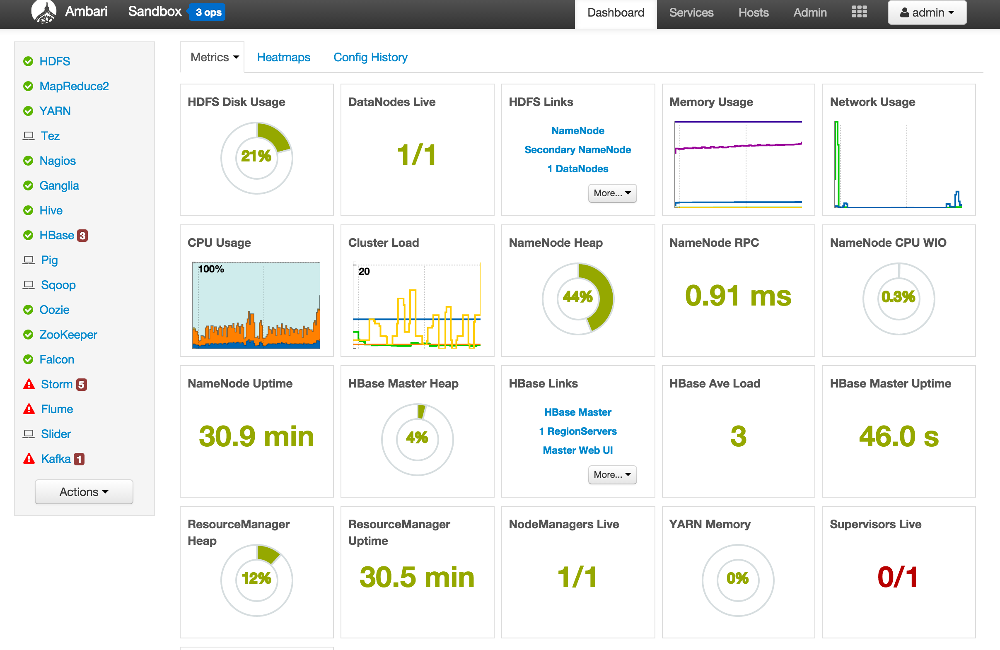
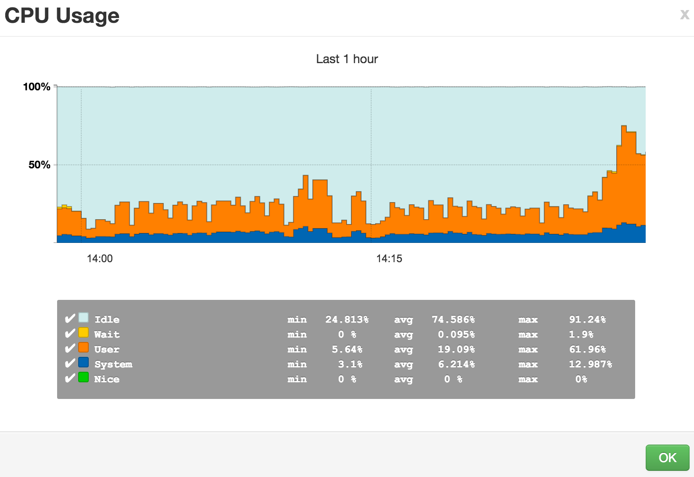
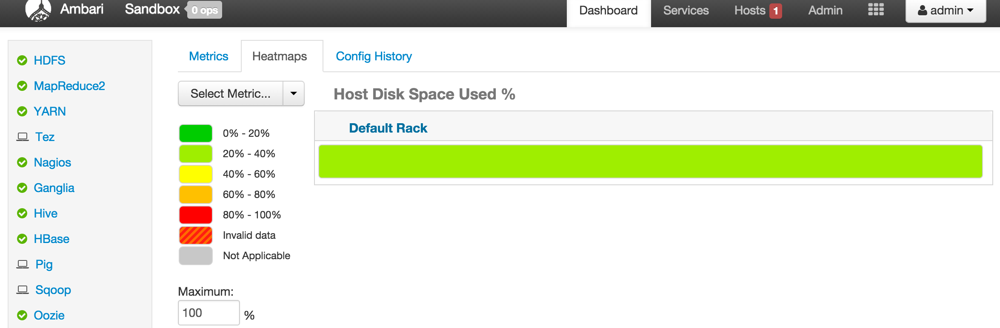
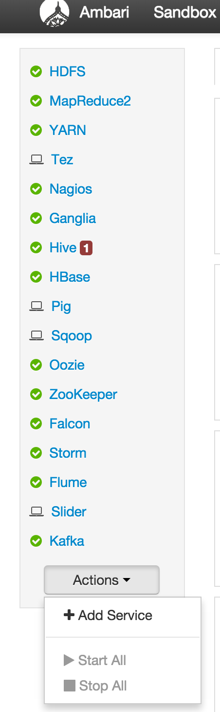
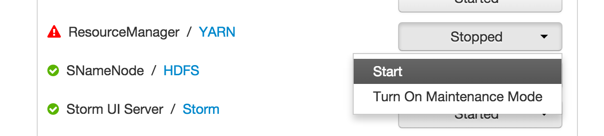

    %%javascript
    $.getScript('http://asimjalis.github.io/ipyn-ext/js/ipyn-present.js')

<!-- 
This file was auto-generated from markdown using notedown.
Instead of modifying the ipynb modify the markdown source. 
-->

<h1 class="tocheading">Monitoring</h1>

Monitoring, Reporting and Alerting
==================================

Rationale
---------

- Cluster management is an essential part of being a Data Engineer. 

- The ability to provision clusters, manage them and monitor them can be
simplified by using [Apache Ambari](https://ambari.apache.org/).

Objective
---------

After this lecture one should be able to:

- Deploy and manage configuration changes on a multinode cluster.

- Monitor a cluster for performance of nodes.

- Use Ambari web interface.

- Administer YARN.

- Use the CLI to manage processes.

Concrete Example
================

Ambari Landing Page
-------------------

CPU Statistics
--------------

Disk Usage Heat Map
-------------------

Process Status
--------------

Starting A Process
------------------

Pop Quiz
--------

- Host Disk usage heat maps are red, when we put only 30GB files in a
  100GB node. Why?

- How long has the Resource Manager been up?

- How do we add a service using Ambari?
