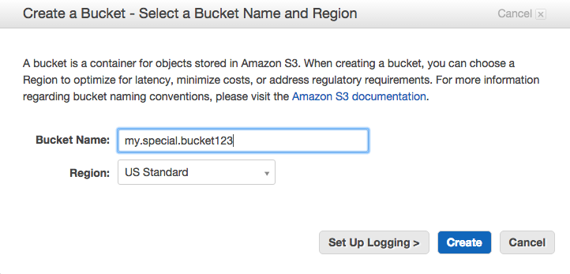
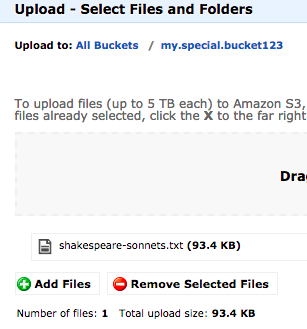
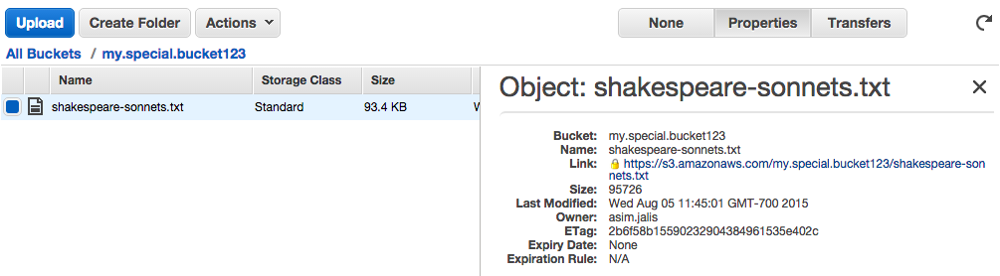

Part 1: S3 on AWS
-----------------

S3 is the strorage system on AWS. Here you will practice interacting
with it via the Amazon GUI and with the Python library `boto`. You
should know how to read and write files to S3 using a python script at
the end of this exercise.

- Log into your [Amazon account](http://aws.amazon.com/console/) and
  create an S3 bucket using the GUI.

  

- **The bucket name must be:** (1) Unique (no one has ever used it).
  Prefix it with a unique id. (2) Lowercase. (3) Must not have
  underscore.
   
- Upload (using the GUI) `../../data/shakespeare-sonnets.txt` to your
  bucket. 
  
  
  
- Note the link to the file.
   
  

- Write a program that reads the file from S3.

- Calculate the frequencies of all the words in the file.

- Word frequencies are frequently used to group similar documents
  together. For example, news stories about the same subject will tend
  to have similar word frequencies.

- Sort the words in descending order of frequency.

- Print out the 20 most frequently used words and their frequencies.

- Upload the calculated and sorted frequencies for all the words to
  S3.

  **Hint: See [`code/boto_reference.py`](code/boto_reference.py)**

Part 2: EC2 on AWS
------------------

EC2 is a remote virtual machine that runs programs much like your
local machine. Here you will learn how to run tasks on an EC2 machine.
Most EC2 instances come without a lot of the packages you need. Here
we will use an instance that has most the data science packages
installed.

- Launch the data science EC2 using the AMI shown below. Seach for the
  AMI in the Community EMIs. Remember to pick a keypair which you have
  the `.pem` file for. Wait for the `Status Checks` to be completed
  before moving on.

  ``` US East (Northern Virginia)	    us-east-1	ami-d1737bb8 ```

- Log into the instance you have launched using `ssh`. The user name
  is `ubuntu``. Replace `YOUR-KEY-PAIR` and `YOUR-EC2-MACHINE` with
  the appropriate values.

  ```
  ssh -X -i ~/.ssh/YOUR-KEY-PAIR.pem ubuntu@YOUR-EC2-MACHINE.amazonaws.com
  ```

- Remember to change the permissions on your `.pem` file if you have
  not already.
   
  `chmod 600 YOUR-KEY-PAIR.pem`
 
- Refer to the script you have written to process
  `shakespeare-sonnets.txt` in `Part 1`. Instead of writing the
  results to the same S3 bucket where `shakespeare-sonnets.txt` is,
  change the script to write to a new bucket. Use `scp` to copy the
  script onto the EC2 instance.
   
- Run the script on the EC2 instance and check S3 to make sure the
  results are transferred to a new bucket. 
  
- In practice, you will be testing the script locally with a smaller
  subset of the data. Once it works you will the script on the whole
  set on EC2.
