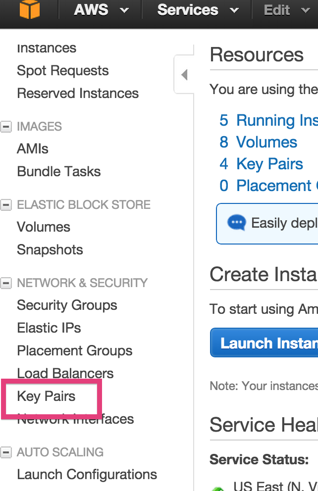
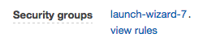
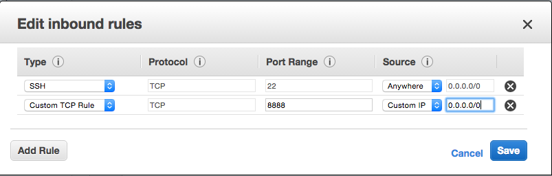

Part 0: Setting up AWS
----------------------

This week we will be needing a lot of AWS. Following the instructions
below to set up your account and claim the free credit that is
avaliable to you.

### Step 1: Create an AWS account

Go to [http://aws.amazon.com/](http://aws.amazon.com/) and sign up: 

- You may sign in using your existing Amazon account or you can create
  a new account by selecting **Create a free account** using the
  button at the right, then selecting **I am a new user**.
  
- Enter your contact information and confirm your acceptance of the
  AWS Customer Agreement.

- Once you have created an Amazon Web Services Account, you may need
  to accept a telephone call to verify your identity. Some people have
  used Google Voice successfully if you don't have or don't want to
  give a mobile number.
  
- Once you have an account, go to
  [http://aws.amazon.com/](http://aws.amazon.com/) and sign in. You
  will work primarily from the Amazon Management Console.

- Create Security Credentials.  Go to the [AWS security credentials
  page](https://console.aws.amazon.com/iam/home?#security_credential).
  If you are asked about IAM users, close the message.  Expand
  **Access Keys** and click **Create New Access Key**.  You will see a
  message **Your access key (access key ID and secret access key) has
  been created successfully**. Click **Download Key File** and save it
  to your home directory. 
  
  Remember where this file is. It contains the **Access Key ID** and
  **Secret Access Key**. 
  
### Step 2: Set up an EC2 key pair

To connect to an Amazon EC2 instances, you need to create an **SSH key pair**. 

- After setting up your account, go to the <https://console.aws.amazon.com/ec2>

- Choose **N.Virginia** as your region. Do not use a different region.
  *N. Virginia* is the default. Using a different region will require
  configuration to work correctly.

  

- On the left click **Key Pair** and then **Create Key Pair**
  
  
    
- Download and save the `.pem` private key file to a new folder `.ssh`
  in your home directory. Any folder that starts with a `.` will be
  hidden in the folder. In this case, you want to hide the sensitive
  information. 
  
- Change the permissions of the file using this command: 

  ```
  $ chmod 600 </path/to/saved/keypair/file.pem>
  ```

### Step 3: Activate your AWS free credit

As a Galvanize member, you are entitled to free AWS credits. Follow
the steps below to activate your credits. They will come in about two
weeks.

Go to <http://aws.amazon.com/activate/portfolio-signup/> and fill in
your details. Make sure the email you fill in is the one you have
provided earlier to the instructor.

**The Org ID is 15UPn. If you cannnot sign up please let the
instructor know.**

Part 1: S3 on AWS
-----------------

S3 is the strorage system on AWS. Next you will practice interacting
with it through the Amazon GUI and with the Python library `boto`. You
should know how to read and write files to S3 using a Python script at
the end of this exercise.

- Log into the AWS console at <http://aws.amazon.com/console/> and
  create an S3 bucket using the GUI.

  

- **The bucket name must be:** (1) Unique (no one has ever used it).
  Prefix it with a unique id. (2) Lowercase. (3) Must not have
  underscore.
   
- Upload (using the GUI) `../data/shakespeare-sonnets.txt` to your
  bucket. 
  
  
  
- Note the link to the file.
   
  

- Write a program that reads the file from S3.

- Calculate the frequencies of all the words in the file.

- Word frequencies are frequently used to group similar documents
  together. For example, news stories about the same subject will tend
  to have similar word frequencies.

- Sort the words in descending order of frequency.

- Print out the 20 most frequently used words and their frequencies.

- Upload the calculated and sorted frequencies for all the words to
  S3.

  Hint: See [`code/boto_reference.py`](code/boto_reference.py)

Part 2: EC2 on AWS
------------------

EC2 is a remote virtual machine that runs programs much like your
local machine. Here you will learn how to run tasks on an EC2 machine.
We will use an instance that has data science packages pre-installed.

- Launch the data science EC2 using the AMI shown below. Seach for the
  AMI in the Community EMIs. Remember to pick a keypair which you have
  the `.pem` file for. Wait for the `Status Checks` to be completed
  before moving on.

        US East (Northern Virginia)
        us-east-1	
        ami-d1737bb8

- Log into the instance you have launched using `ssh`. The user name
  is `ubuntu``. Replace `KEY-PAIR` and `EC2-INSTANCE` with
  the appropriate values.

        ssh -X -i ~/.ssh/KEY-PAIR.pem ubuntu@EC2-INSTANCE.amazonaws.com

- Remember to change the permissions on your `.pem` file if you have
  not already. `chmod 600 KEY-PAIR.pem`
 
- Refer to the script you have written to process
  `shakespeare-sonnets.txt` in `Part 1`. Instead of writing the
  results to the same S3 bucket where `shakespeare-sonnets.txt` is,
  change the script to write to a new bucket. Use `scp` to copy the
  script onto the EC2 instance.
   
- Run the script on the EC2 instance and check S3 to make sure the
  results are transferred to a new bucket. 
  
- In practice, you will be testing the script locally with a smaller
  subset of the data. Once it works you will the script on the whole
  set on EC2.

Part 3: Running IPython Notebook on EC2
---------------------------------------

- Login to the EC2 instance that you created for the previous part of
  the exercise. (Replace KEY-PAIR and EC2-INSTANCE with the actual
  values.)

        ssh -X -i ~/.ssh/KEY-PAIR.pem ubuntu@EC2-INSTANCE.amazonaws.com
  
- Paste the following into the ssh shell connected to the EC2 instance
  to install the necessary packages on the instance.

        # Install all the necessary packages
        sudo pip install --upgrade pip 
        sudo pip install --upgrade "ipython[notebook]"
   
- To get IPython to work on your EC2 instance, you need to change the
  **Security Settings** to enable the inbound requests to be made.

- Click on the Security Group for your instance.

  
 
- In the Security Group, select **Inbound**, then **Edit**, and then
  **Add Rule**. The **Port Range** should be `8888` and the **Source**
  is `0.0.0.0/0`

  

- Save the rule.

- Start a new tmux session.

        tmux new -s notebook

- Start IPython notebook in the tmux session using this command.

        ipython notebook --no-browser --ip=0.0.0.0
   
- The notebook should be available on port 8888 at the public DNS
  address of the instance.

        http://EC2-INSTANCE.amazonaws.com:8888

- Make sure you *stop* or *terminate* your EC2 instances after you are
  done with them. Otherwise the hourly charges will keep accumulating.
