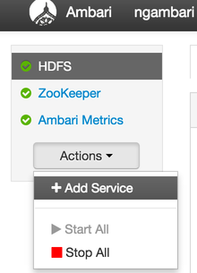
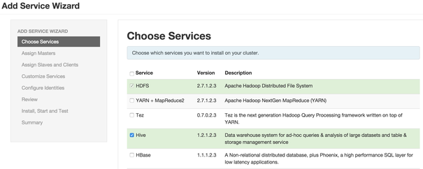
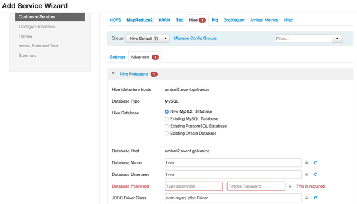

##Individual Assignment

### Installing Hive 
Hive can be installed in the following two ways (assuming HDFS cluster is already running)  

- Direct Download:  
	+ [Download Hive tar](http://www.apache.org/dyn/closer.cgi/hive/). This will create a sub directory named `hive-x.y.z` where x.y.z is the release number.  
	+ Unpack the tar.
	<pre><code>tar -xzvf hive-x.y.z.tar.gz</code></pre>
	+ Set the Hive_Home envionment variable to poit to the installation directory.
	<pre><code>cd hive-x.y.z
    export HIVE_HOME={{pwd}}</code></pre>
    + Add HIVE_HOME/bin to your PATH.
    <pre><code>export PATH=$HIVE_HOME/bin:$PATH</code></pre>
    + Verify installation by running `hive` command. You would be taken to the hive command line interface.  

- Using *Ambari*
	+ Assuming, you have a cluster running and are logged into the Ambari web UI, click `Add Services` on the left hand side panel.  
	  
	+ Select Hive and click on Next. (Depending on the HDP version, you would be prompted to add some other dependent services.)  
	 
	+ After, selecting the nodes on which services are to be installed, assign a new password for the underlying database to be used by Hive in the configuration settings.  
	 
	+ Review and confirm the installation to begin.
	+ You may have to Restart certain services according to the prompt by Ambari.
	+ Verify the installation by running the `hive` command on a terminal on the host where `HiveServer2` was installed.
    
    
- Download Data from **link to be inserted**.
Upload `links.csv` and `movies.csv` to the HDFS and let `tags.csv` and `ratings.csv` be in your `~/HiveInput/` folder.
- Write Hive Queries to perform the following actions.

	+ Count the number of movies in the `movies` table.
	+ Count the number of distinct tags grouped by tags.
	+ Store the names if movies with the word `and` in them to your local machine. 
	+ Perform left join on ratings and movies table on the `movieID` column to get title and ratings.
	+ Perform join on movies and tag table on the `movieID` column and store the data the on HDFS in folder `user/root/userInput`
	+ Use `Drop table` command on the `movies` table and check the respective forlder.
	+ Check the output of `desc` and `desc extended` command on `ratings.csv` table.
