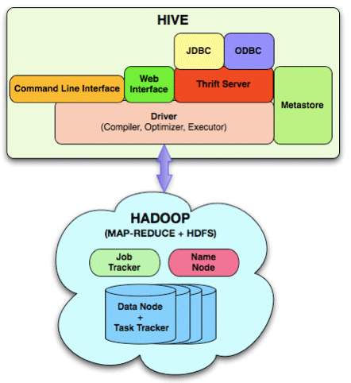

Hive
====

Why Hive 
--------

- Instead of writing MapReduce programs what if we could write SQL.

- Hive lets you write MapReduce programs in SQL.

- This is then translated to MapReduce on the fly.

Hive Example
------------

```sql
SELECT user.*
FROM user
WHERE user.active = 1;
```

Hive
----

- Hive was developed at Facebook.

- It translates SQL to generate MapReduce code.

- Its dialect of SQL is called HiveQL.

- Data scientists can use SQL instead of MapReduce to process data.

Why Hive
--------

How can we analyze Big Data without writing MapReduce jobs?

- Apache Hive runs SQL queries against large datasets.

- Datasets can be in HDFS, S3, and other Hadoop-compatible filesystems.

- Used for queries against data without writing Java/Python code.

- Used for ad hoc queries against data without schemas.


Big Data SQL
-------------

What other Big Data SQL technologies are out there? Why should I use
Hive?

Project            |Elevator Pitch
-------            |--------------
Hive               |Mature, full-featured
Hive on Tez        |Hive optimized over MapReduce
Hive on Spark      |Hive optimized using Spark
Spark SQL          |SQL from scratch on Spark; not as full-featured
Shark              |Hive on Spark; abandoned
Impala             |SQL without MapReduce using C++; focus on speed
Phoenix            |SQL over HBase
Trafodion          |SQL engine by HP
Presto             |SQL engine by team at HP
Drill              |SQL engine by MapR, does well on some queries
Flink              |SQL engine with support for realtime data


Hive vs RDBMS
-------------

What are the pros and cons of Hive vs traditional databases (RDBMS)?

Hive                                  |RDBMS
----                                  |-----
HiveQL (subset of SQL-92)             |SQL Interface
Schema On Read                        |Schema On Write
Write Once, Read Many Times           |Read Many Times, Write Many Times
Optimal for static data               |Optimal for dynamic data
Transactions not supported            |Transactions supported
Highly distributed processing via MR  |Limited distributed processing
Handles 100s of Petabytes             |Handles 10s of Terabytes
Uses commodity hardware               |Uses proprietary hardware
Slow response time                    |Fast response time
For batch processing                  |For realtime processing

Hive History
------------

Date           |Version
----           |-------
Jun 19, 2015   |1.2.1
May 11, 2015   |1.2.0
Feb 12, 2015   |1.1.0
Nov 8, 2014    |0.14
Apr 15, 2014   |0.13
Oct 17, 2013   |0.12
Jun 28, 2013   |0.11
Apr 9, 2013    |0.10
Dec 16, 2011   |0.8


Hive Architecture
-----------------



- Hive stores metadata about tables in the *MetaStore*

- When a SQL or HiveQL query is submitted to Hive it translates it to
  MapReduce, using the MetaStore.

- Then it submits it to the cluster as a MapReduce job.

MetaStore
---------

What does the MetaStore store?

SQL          |MetaStore Maps To
---          |-----------------
Table Name   |HDFS Directory 
Column Name  |Column Position
Column Type  |Stored Data Type

MetaStore Storage
-----------------

Where does the MetaStore store this information?

- By default it stores it in an embedded database called Derby.

- Most admins configure it to use MySQL instead.

Pop Quiz
--------

<details><summary>
Why does the MetaStore not use HDFS to store the metadata?
</summary>
1. The metadata changes constantly.<br>
2. The metadata changes every time you add a new table or alter a table.<br>
3. HDFS does not allow modifying data.<br>
</details>

<details><summary>
What is the benefit of having a shared MySQL-backed MetaStore instead
of each user having his/her own Derby-backed MetaStore?
</summary>
1. Sharing the MetaStore means everyone uses the same table and column names.<br>
2. This makes the SQL consistent and portable across the organization.<br>
</details>

Hive Shell
----------

How can I start the Hive shell?

- Start VirtualBox.

- Select *Hortonworks Sandbox*

- Holding down the *Shift* key click *Start*. This brings up the
  machine headless.

- Connect to it using `ssh -p 2222 root@127.0.0.1`

- Use `hadoop` as the password.

- Type `hive` to start the Hive shell.

Hive Shell Commands
-------------------

What are some convenient commands in the Hive shell?

Command                         |Meaning
-------                         |-------
`!ls;`                          |List files on local machine
`dfs -ls;`                      |List files on HDFS
`set mapred.reduce.tasks=32;`   |Set (Hadoop and/or Hive) configuration parameter
`set mapred.reduce.tasks;`      |Print configuration parameter value
`set;`                          |Print all overridden configuration parameter values
`set -v;`                       |Print all configuration parameter values
`source myscript.sql;`          |Run HiveQL script in shell
`SHOW TABLES;`                  |List all tables
`DESCRIBE sales;`               |Describe table `sales`
`DESCRIBE FORMATTED sales;`     |Describe table `sales` in a lot of detail
`quit;`                         |Exit the Hive shell

Hive Scripting
--------------

How can I embed Hive into a batch script?

Command                              |Meaning
-------                              |-------
`hive -e 'SELECT * FROM movies'`     |Run SQL and display result
`hive -S -e 'SELECT * FROM movies'`  |Run SQL with less logging output and display result
`hive -f hive-script.sql`            |Run SQL in `hive-script.sql`


Creating Tables
===============

How To Create Tables
--------------------

How can I use Hive with data I already have in HDFS?

### Upload data to HDFS

```sh
# Create sales.csv.
cat <<'END_OF_DATA' > sales.csv
#ID,Date,Store,State,Product,Amount
101,2014-11-13,100,WA,331,300.00
104,2014-11-18,700,OR,329,450.00
102,2014-11-15,203,CA,321,200.00
106,2014-11-19,202,CA,331,330.00
103,2014-11-17,101,WA,373,750.00
105,2014-11-19,202,CA,321,200.00
END_OF_DATA

# Upload it to HDFS.
hadoop fs -rm -r /user/root/sales
hadoop fs -mkdir /user/root/sales
hadoop fs -put   sales.csv /user/root/sales/part1.csv

# Test it was uploaded to HDFS.
hadoop fs -ls -R /user/root/sales
hadoop fs -cat "/user/root/sales/*"
```

### Create External Table

In the Hive shell:

```sql
-- Drop table if it exists.
DROP TABLE IF EXISTS  sales;

-- Create external table.
CREATE EXTERNAL TABLE sales(
  id INT,
  sale_date STRING,
  store INT,
  state STRING,
  product INT,
  amount DOUBLE
)
ROW FORMAT DELIMITED 
FIELDS TERMINATED BY ','
STORED AS TEXTFILE
LOCATION '/user/root/sales'
TBLPROPERTIES("skip.header.line.count"="1");

-- Select table to test.
SELECT * FROM sales;
```

Pop Quiz: Creating Tables
-------------------------

<details><summary>
Does `CREATE TABLE` have an effect on the MetaStore or on HDFS or
both?
</summary>
1. Creating external tables adds metadata to existing HDFS data.<br>
2. It only affects the metastore where the metadata is stored.<br>
3. It does not affect the data in HDFS.<br>
4. In fact you can create a table with no data in HDFS, and add the
data later.<br>
</details>

Pop Quiz: Creating Tables
-------------------------

<details><summary>
Can I create multiple external tables on the same data in HDFS?
</summary>
It would be slightly weird, but yes, you can do this.
</details>


Internal and External Tables
----------------------------

What is the difference between *internal* and *external* tables?

Command                       |Internal Table               |External Table
-------                       |--------------               |--------------
`CREATE TABLE`                |Default                      |Requires `EXTERNAL` keyword
HDFS Location                 |`/user/hive/warehouse`       |User specifies location
`DESCRIBE FORMATTED mytable`  |`TABLE TYPE: MANAGED_TABLE`  |`TABLE TYPE: EXTERNAL_TABLE`
`DROP TABLE mytable`          |Deletes metadata + data      |Only deletes metadata

Pop Quiz
--------

<details><summary>
I changed my mind about what I want to call the columns on my
internal table. Should I drop the table and start over?
</summary>
1. Noooo!<br>
2. Be very careful with `DROP` and internal tables.<br>
3. Use `ALTER` instead.<br>
4. Conceptually an internal table is a table for which Hive manages
the data.<br>
</details>

Creating Internal Tables
------------------------

How can I create an internal table?

- Use same syntax as `CREATE TABLE` but leave out `LOCATION` and
  `EXTERNAL`.

```sql
-- Drop table if it exists.
DROP TABLE IF EXISTS  sales_tmp;

-- Create internal table.
CREATE TABLE sales_tmp(
  id INT,
  sale_date STRING,
  store INT,
  state STRING,
  product INT,
  amount DOUBLE
)
ROW FORMAT DELIMITED 
FIELDS TERMINATED BY ','
STORED AS TEXTFILE
TBLPROPERTIES("skip.header.line.count"="1");

-- Select table to test.
SELECT * FROM sales_tmp;
```

Pop Quiz: Internal Tables
-------------------------

<details><summary>
What are some use cases for internal tables?
</summary>
1. You can use them for temporary data.<br>
2. You can use them to share data between different users.<br>
3. The delete-on-drop behavior matches the behavior of traditional databases.<br>
</details>

Data Ingestion
==============

Pop Quiz: Why Ingest Data
-------------------------

<details><summary>
What are some use cases for ingesting data?
</summary>
1. Internal tables start out with no data. After you create the table
you have to ingest data into it.<br>
2. If you have daily incoming data you have to ingest it into existing
tables.<br>
</details>

How To Ingest Data
------------------

How can I ingest data into an existing table?

### Shell

```sh
# Upload to HDFS.
hadoop fs -rm -r /user/root/sales_tmp
hadoop fs -mkdir /user/root/sales_tmp
hadoop fs -put   sales.csv /user/root/sales_tmp/part1.csv

# Test it was uploaded to HDFS.
hadoop fs -ls -R /user/root/sales_tmp
hadoop fs -cat "/user/root/sales_tmp/*"
```

### Hive

```sql
-- Load data to Hive.
LOAD DATA 
INPATH '/user/root/sales_tmp' 
OVERWRITE 
INTO TABLE sales_tmp;

-- Check it is in Hive.
SELECT * FROM sales_tmp;
```

### Shell

```bash
# Check data in HDFS again.
hadoop fs -ls -R /user/root/sales_tmp

# Find location of data
hive -e "DESCRIBE FORMATTED sales_tmp;"
```

### Hive

```bash
# Check data in Hive's warehouse dir. 
hadoop fs -ls -R /apps/hive/warehouse/sales_tmp
```

Pop Quiz: Ingesting Data
------------------------

<details><summary>
What happened to the data in HDFS when we ingested it?
</summary>
1. `LOAD DATA` moves the data to a Hive-managed directory.<br>
2. The data is no longer where you uploaded it.<br>
</details>

<details><summary>
Is the data for the internal tables stored in HDFS or in the metastore?
</summary>
1. The data is stored in HDFS.<br>
2. The data will be too large for the metastore.<br>
3. The metastore is stored in MySQL or some other small database.<br>
4. It only has metadata: table names, table locations, column names, column types, etc. <br>
5. It does not have any table data.<br>
</details>


Ingesting Data
--------------

What are the different ways of ingesting data and appending to the table?

Commmand                                                 |Path On |Deletes Source
--------                                                 |------- |--------------
`LOAD DATA INPATH 'path' INTO TABLE t1`                  |HDFS    |Yes
`LOAD DATA LOCAL INPATH 'path' INTO TABLE t1`            |Client  |No

What are the different ways of ingesting data and overwriting the table?

Commmand                                                 |Path On |Deletes Source
--------                                                 |------- |--------------
`LOAD DATA INPATH 'path' OVERWRITE INTO TABLE t1`        |HDFS    |Yes
`LOAD DATA LOCAL INPATH 'path' OVERWRITE INTO TABLE t1`  |Client  |No


Pop Quiz: Dropping Tables
-------------------------
<details><summary>
How can I drop a table I no longer need?
</summary>
1. `DROP TABLE sales;`<br>
2. `DROP TABLE IF EXISTS sales;`<br>
3. Using `IF EXISTS` is less error prone.<br>
</details>

Queries
=======

Select
------

Now that we have our data in Hive we can run `SELECT` on it.

<details><summary>
What are all the transactions that were more than $300?
</summary>
`SELECT * FROM sales WHERE amount > 300;`
</details>

<details><summary>
How can I see the first 3 transactions?
</summary>
`SELECT * FROM sales LIMIT 3;`
</details>

Aggregating Using Group By
--------------------------

How can we find the total sales per state?

```sql
SELECT state, SUM(amount) 
FROM sales
GROUP BY state;
```

Aggregate Functions
-------------------

How can we find the average sales per state?

```sql
SELECT state, AVG(amount) 
FROM states 
GROUP BY state;
```

Functions
---------

Where can I get more details about all the Hive functions?

- [Hive Documentation: Built-in Functions][hive-funcs]

- Hive has built-in boolean operators, mathematical functions, string functions,
  aggregate functions, and many others.

- It also lets you write your custom *User-Define Functions* (UDFs) and
  *User-Defined Aggregate Functions* (UDAFs) using Java, Python, and other
  languages.

[hive-funcs]: https://cwiki.apache.org/confluence/display/Hive/LanguageManual+UDF

Sorting
=======

Sorting Data
------------

How can I sort the transactions ordered by amount, highest first?

- Set the number of reducers to 2.

```sql
set mapred.reduce.tasks=2;
```

- Compare the output of `SORT BY` and `DISTRIBUTE BY`.

- Why is `SORT BY` not sorting the result?

```sql
SELECT * FROM sales SORT BY amount DESC;
SELECT * FROM sales DISTRIBUTE BY amount SORT BY amount DESC;
```

Sorting Options
---------------

What are the different ways I can sort data in Hive?

```sql
SELECT * FROM sales ORDER BY amount DESC;
SELECT * FROM sales SORT BY amount DESC;
SELECT * FROM sales CLUSTER BY amount; 
SELECT * FROM sales DISTRIBUTE BY amount SORT BY amount DESC;
```

### Order By

`ORDER BY x`

- Uses only 1 reducer
- Reducer's output is sorted
- Does not scale for large datasets when you need more reducers

### Sort By

`SORT BY x`

- Each reducer's output is sorted
- Concatenated result is **not** sorted

### Distribute By

`DISTRIBUTE BY x` 

- The output of each reducer is not sorted 
- The output of each reducer is ordered relative to output of other reducers
- Partitions data so that the lower-index reducers get smaller keys

### Cluster By

`CLUSTER BY x` 

- Combines `DISTRIBUTE BY` and `SORT BY`
- Partitions the data so the output of each reducer is ordered relative to others
- Sorts the output of each reducer 
- Produces globally sorted output
- Scalable version of `ORDER BY`
- Does not support `DESC`

Pop Quiz: Sorting
-----------------

<details><summary>
How should I sort a small sales table on amount?
</summary>
`SELECT * FROM sales ORDER BY amount DESC;`
</details>

<details><summary>
How can I sort a large sales table in ascending order?
</summary>
`SELECT * FROM sales CLUSTER BY amount;`
</details>

<details><summary>
How can I sort a large sales table in descending order?
</summary>
`SELECT * FROM sales DISTRIBUTE BY amount SORT BY amount DESC;`
</details>


Inserting Data
==============

Using Insert/Select to Save Data
--------------------------------

How can save the results of calculating the average sales?

```sql
-- Create the table.
CREATE TABLE sales_avg(
  state STRING,
  amount DOUBLE
)
ROW FORMAT DELIMITED 
FIELDS TERMINATED BY ','
STORED AS TEXTFILE
TBLPROPERTIES("skip.header.line.count"="1");

-- Insert selected data.
INSERT OVERWRITE TABLE sales_avg 
SELECT states.state, AVG(amount) 
FROM states 
LEFT OUTER JOIN sales 
ON sales.state = states.state 
GROUP BY states.state;
```

### Shell 

```bash
# Check that table has data.
hadoop fs -ls -R /apps/hive/warehouse/sales_avg
hadoop fs -cat "/apps/hive/warehouse/sales_avg/*"
```

Insert/Select Details
---------------------

How can I use `SELECT` to append to a table instead of overwriting it?

### Hive

```sql
-- Append selected data.
INSERT INTO TABLE sales_avg 
SELECT states.state, AVG(amount) 
FROM states 
LEFT OUTER JOIN sales 
ON sales.state = states.state 
GROUP BY states.state;
```

### Shell

```bash
# Check that table has data.
hadoop fs -ls -R /apps/hive/warehouse/sales_avg
hadoop fs -cat "/apps/hive/warehouse/sales_avg/*"
```

Pop Quiz: Insert/Select Notes
-----------------------------

<details><summary>
What is a quick way to delete the contents of a table?
</summary>
`INSERT OVERWRITE TABLE sales_avg SELECT * FROM sales_avg WHERE 1 = 0;`
</details>


