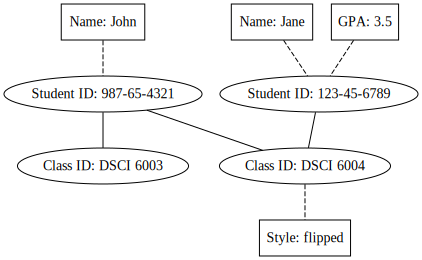

miniquiz
========

1. Why do we vertically partition our data?
	1. It makes it simpler to move data into the batch layer.
	2. It makes it simpler to restrict queries to certain data.
	3. It obviates the need to stage data.
	4. It makes storage easier.
2. Given a graph schema, what will we typically partition on (check all that apply):
	1. properties
	2. edges
	3. nodes
	4. tables
3. Which of the following are storage requirements for the master dataset:
	1. Efficient compaction of unused space
	2. Random access to data
	3. Support for parallel processing
	4. Efficient appends of new data
4. Given the following graph schema:   
Write out how you would vertically partition facts.