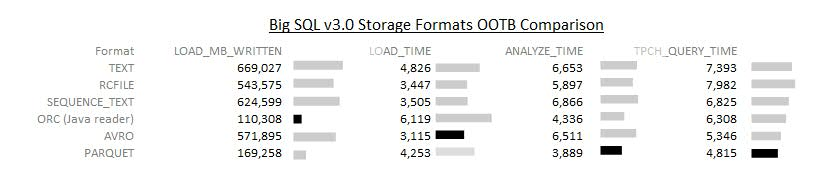

% Hive

Data Formats
============

Why Data Formats
----------------

I want to store my data in a more compact binary form and not as text.
How can I convert my sales table into Avro?

- A common use case for Hive is to convert data between different
  formats.

- A data format or storage format is a part of the file's metadata.

<details><summary>
What command can we use to define the data format for a table?
</summary>
`CREATE TABLE`
</details>

Defining Table Data Formats
---------------------------

How can I convert the sales table to Avro?

```sql
-- Drop table if it exists.
DROP TABLE IF EXISTS sales_avro;

-- Create external table.
CREATE TABLE sales_avro(
  id INT,
  sale_date STRING,
  store INT,
  state STRING,
  product INT,
  amount DOUBLE
)
STORED AS AVRO;

-- Insert data.
INSERT OVERWRITE TABLE sales_avro
SELECT * 
FROM sales;

-- Select table to test.
SELECT * FROM sales_avro;
```

Storage Formats
---------------

What storage formats can I define for my tables?

In `CREATE TABLE` or `CREATE EXTERNAL TABLE` you can specify the
format for your data.

Storage Format             |Meaning
--------------             |-------
`STORED AS TEXTFILE`       |Stored as text (default)
`STORED AS PARQUET`        |Stored as Parquet
`STORED AS AVRO`           |Stored as Avro
`STORED AS SEQUENCEFILE`   |Stored as SequenceFile
`STORED AS ORC`            |Stored as ORC


Pop Quiz
--------

<details><summary>
What is an easy way to convert CSV files to Parquet?
</summary>
1. Define table 1 using `STORED AS TEXTFILE`.<br>
2. Define table 2 using `STORED AS PARQUET`.<br>
3. Load the data into table 1.<br>
4. Insert/select the data from table 1 to table 2.<br>
5. Hive is commonly used for data conversion.<br>
</details>


Text vs Binary
--------------

Should I use a text or a binary format?

- Text is human readable but inefficient at scale.

Avro vs Parquet vs ORC
----------------------

Which binary format should I use?

- The optimal data format depends on nature of your data.

- Parquet and ORC (Optimized Row Columnar) are columnar, and are good
  for "narrow" data.

- Narrow means the data has few columns and the rows are repetitive. 

- Avro is non-columnar and is good for unstructured "wide" data.

- Wide means the data has lots of columns and each row is different.

Parquet vs ORC
--------------

Between ORC and Parquet which one should I use?

- ORC and Parquet are competing industry standards. Like Betamax and
  VHS.

- Parquet is more popular overall.

- According to [research][ibm-parquet] from IBM in September 2014 ORC
  uses less storage but Parquet has faster query times.

[ibm-parquet]: https://developer.ibm.com/hadoop/blog/2014/09/19/big-sql-3-0-file-formats-usage-performance/




RC File
-------

What is the RC File format?

- RC (Record Columnar) is an older version of ORC (Optimized Row Columnar).

SequenceFiles
-------------

When should I use SequenceFiles?

- SequenceFiles are a binary format used by MapReduce that stores data
  as key-value pairs.

- Useful for storing intermediate data between a chain of MapReduce
  jobs.

- Easy to use in programs.

- Unlike other binary formats, SequenceFiles only work with Java.

SerDes
------

What is a `SerDe`?

- `SerDe` is a short name for *Serializer and Deserializer*.

- Using these Hive can read and write to any data source can read and
  write a sequence of records.

- There are many 3rd party SerDes such as Amazon's JSON SerDe.

- Using Hive's developer API you can write your own custom SerDes.

Joins
=====

Joining Tables
--------------

How can expand the state IDs to get full state names?

### Bash: Upload data to HDFS

```sh
# Create states.csv.
cat <<'END_OF_DATA' > states.csv
#State,Name
CA,California
WA,Washington
NV,Nevada
END_OF_DATA

# Upload it to HDFS.
hadoop fs -rm -r /user/root/states
hadoop fs -mkdir /user/root/states
hadoop fs -put   states.csv /user/root/states/part1.csv

# Test it was uploaded to HDFS.
hadoop fs -ls -R /user/root/states
hadoop fs -cat "/user/root/states/*"
```

### Hive: Create Hive table on data

```sql
-- Drop table if it exists.
DROP TABLE IF EXISTS  states;

-- Create external table.
CREATE EXTERNAL TABLE states(
  state STRING,
  name STRING
)
ROW FORMAT DELIMITED 
FIELDS TERMINATED BY ','
STORED AS TEXTFILE
LOCATION '/user/root/states'
TBLPROPERTIES("skip.header.line.count"="1");

-- Select table to test.
SELECT * FROM states;
```

Joining Tables
--------------

Join the sales and states tables.

### Hive: Join tables

```sql
SELECT * FROM states JOIN sales ON sales.state = states.state;
```

Pop Quiz
--------

<details><summary>
By default did `JOIN` do an inner join or an outer join?
</summary>
1. This was an inner join.<br>
2. Notice that Nevada was not in the output.<br>
3. Also Oregon was not in the output.<br>
4. Why were these two states missing?<br>
</details>

Join Details
------------

Why are joins important?

- Joins are indispensible for most interesting data analysis.

- Incoming data has references to lookup tables.

- Lookup tables map keys to detailed information.

- To denormalize the data you join the incoming data with the lookup tables on the keys.

Star Schema
-----------

- Star schema separates business process data into fact tables and
  dimension tables.

- Facts are measurable, quantitative data about a business For
  example, sales transactions. 
 
- Dimensions are descriptive attributes related to fact data. For
  example, product models, colors, sizes, and salesperson names.

- Fact tables are connected to dimension tables through foreign keys.

Pop Quiz: Star Schema
---------------------

<details><summary>
How can we combine fact tables with dimension tables?
</summary>
Using join.<br>
</details>

<details><summary>
Between `sales` and `states` which is the fact table and which is the dimension table? 
</summary>
1. `sales` is the fact table.<br>
2. `states` is the dimension table.<br>
</details>

<details><summary>
Between fact and dimension tables, which is likely to be larger?
</summary>
1. Fact tables are larger and have more churn.<br>
2. Dimension tables are smaller and are more stable.<br>
3. `sales` will be larger than `states`.<br>
</details>

Join Optimization
-----------------

My joins are taking too long. What can I do?

- The simplest heuristic is to put the largest table last.

- We will talk about other techniques in the next lecture.

Pop Quiz
--------

<details><summary>
Which order should I join `sales` and `states`?
</summary>
1. `states` should be first.<br>
2. `sales` should be last.<br>
3. Mneumonic: *LTL* (Largest Table Last).<br>
</details>

Join Types
----------

What are the different types of join in Hive?

Join Type              |Includes Rows That
---------              |------------------
`JOIN`                 |Matches found in both table
`LEFT OUTER JOIN`      |Match in left table but no match in right
`RIGHT OUTER JOIN`     |Match in right table but no match in left
`FULL OUTER JOIN`      |Match in either left or right table 

Pop Quiz
--------

Consider this query:

```sql
SELECT * FROM states JOIN sales ON sales.state = states.state
```

<details><summary>
Which join should I use to get sales transactions with invalid states in this
query? 
</summary>
`RIGHT OUTER JOIN`
</details>

<details><summary>
Which join should I use to include states with no sales transactions in this
query? 
</summary>
`LEFT OUTER JOIN`
</details>


Storage Layout
==============

Optimizing Storage Layout
-------------------------

By default Hive does full table scans on queries.

Is it possible to do better than this?

- If the data is laid out in a way so we know which HDFS file or
  directory to scan we can avoid full-table scans.

- *Partitioned* and *Bucketed* tables are some ways of laying out HDFS
  directories and files to speed up queries.

Partitioned Tables
==================

Why Partitioned Tables
----------------------

<details><summary>
Suppose we always query the data with a `state` value in the `WHERE`
clause. How can we do better than scanning the full table (i.e.
scanning all the HDFS files under `sales`) for each query?
</summary>
1. If we store the records in separate sub-directories, one per state.<br>
2. Then if the query was for `'CA'` we could just scan the directory for `'CA'`.<br>
3. This is called *partitioning*.<br>
</details>

Partitioning Example
--------------------

Suppose we partition this table based on state and save it into
`sales_part`.

ID   |Date        |Store  |State  |Product  |Amount
--   |----        |-----  |-----  |-------  |------
101  |2014-11-13  |100    |WA     |331      |300.00
104  |2014-11-18  |700    |OR     |329      |450.00
102  |2014-11-15  |203    |CA     |321      |200.00
106  |2014-11-19  |202    |CA     |331      |330.00
103  |2014-11-17  |101    |WA     |373      |750.00
105  |2014-11-19  |202    |CA     |321      |200.00


<details><summary>
How many sub-directories will be created under `/app/hive/warehouse/sales_part`?
</summary>
3 sub-directories:
`/apps/hive/warehouse/sales_part/state=CA/`<br>
`/apps/hive/warehouse/sales_part/state=OR/`<br>
`/apps/hive/warehouse/sales_part/state=WA/`<br>
</details>

Partitioning Pros and Cons
--------------------------

What are the pros and cons of partitioning?

- Pro: It speeds up queries as long as they meet our constraints.

- Con: It slows down queries that do not fix the partitioned column
  (`state` in this case).

- It imposes a structure on the data. It optimizes specific queries at
  the expense of ad hoc queries.

Ingesting Into Partitioned Tables
---------------------------------

- Hive does not touch the directory structure of external tables.

- Therefore partitioned tables have to be internal.

- The steps are: (1) load data into HDFS, (2) insert-select into a
  partitioned table.

Ingesting Into Partitioned Tables
---------------------------------

### Bash: Upload data to HDFS

```sh
# Create sales.csv.
cat <<'END_OF_DATA' > sales.csv
#ID,Date,Store,State,Product,Amount
101,2014-11-13,100,WA,331,300.00
104,2014-11-18,700,OR,329,450.00
102,2014-11-15,203,CA,321,200.00
106,2014-11-19,202,CA,331,330.00
103,2014-11-17,101,WA,373,750.00
105,2014-11-19,202,CA,321,200.00
END_OF_DATA

# Upload it to HDFS.
hadoop fs -rm -r /user/root/sales
hadoop fs -mkdir /user/root/sales
hadoop fs -put   sales.csv /user/root/sales/part1.csv

# Test it was uploaded to HDFS.
hadoop fs -ls -R /user/root/sales
hadoop fs -cat "/user/root/sales/*"
```

### Hive: Create partitioned table

```sql
-- Create external table.
DROP TABLE IF EXISTS  sales;
CREATE EXTERNAL TABLE sales(
  id INT,
  sale_date STRING,
  store INT,
  state STRING,
  product INT,
  amount DOUBLE
)
ROW FORMAT DELIMITED 
FIELDS TERMINATED BY ','
STORED AS TEXTFILE
LOCATION '/user/root/sales'
TBLPROPERTIES("skip.header.line.count"="1");

-- Create partitioned table.
DROP TABLE IF EXISTS  sales_part;
CREATE TABLE sales_part(
  id INT,
  sale_date STRING,
  store INT,
  product INT,
  amount DOUBLE
)
PARTITIONED BY (state STRING)
ROW FORMAT DELIMITED 
FIELDS TERMINATED BY ','
STORED AS TEXTFILE;

-- Insert select into partitioned table.
FROM sales 
INSERT INTO TABLE sales_part PARTITION(state)
SELECT id,sale_date,store,product,amount,state;

-- Select table to test.
SELECT * FROM sales_part;
```

Notes
-----

- Instead of `INSERT INTO` you can use `INSERT OVERWRITE` to overwrite
  the table.

- You have to partition on the last columns.

Pop Quiz
--------

<details><summary>
How many directories do you expect to see in HDFS under `sales_part`?
</summary>
1. The partition count will equal the number of states which is 3.<br>
2. So there should be 3 directories, one per state.<br>
</details>

Lets check.

### Bash: Verify data split between 4 files

```bash
hadoop fs -ls -R /apps/hive/warehouse/sales_part
```

Pop Quiz
--------

<details><summary>
Does `FROM sales INSERT INTO TABLE sales_part ...` delete the data
from `sales`?
</summary>
1. It does not.<br>
2. Only `LOAD DATA` removes the source HDFS file.<br>
3. Insert-select does not remove the source.<br>
</details>


Bucketed Tables
===============

Bucketing Intro
---------------

Partitioning is one way to avoid full table scans. Another is
*bucketing*.

Instead of putting rows with a specific key in a separate directory,
rows whose keys compute the same hash value bucketed into the same
file.

Bucketing
---------

What is bucketing?

- For each row Hive calculates a hash value based on the bucketed
  columns.

- All rows with the same hash value are written to the same file.

Bucketing Example
-----------------

Suppose we split this table into 4 buckets by Store.

ID   |Date        |Store  |State  |Product  |Amount
--   |----        |-----  |-----  |-------  |------
101  |2014-11-13  |100    |WA     |331      |300.00
104  |2014-11-18  |700    |OR     |329      |450.00
102  |2014-11-15  |203    |CA     |321      |200.00
106  |2014-11-19  |202    |CA     |331      |330.00
103  |2014-11-17  |101    |WA     |373      |750.00
105  |2014-11-19  |202    |CA     |321      |200.00

- All rows with same store ID will be in same file.

- All rows will be in one of 4 files.

- Each file represents a random sample of the data.

Why Bucketing
-------------

Why do this?

- The data is relatively evenly spread out between files.

- Buckets are useful for map-side joins across large tables.

- Sampling is faster.

When To Bucket
--------------

When should you bucket?

- If you are planning to join on store bucketing can speed up the
  join.

- If you are running queries on specific stores.

- Bucketing reorganizes the data without creating directory
  hierarchies, as opposed to partitioning.

Bucketing
---------

### Hive: Create bucketed table

```sql
-- Create bucketed table.
SET hive.enforce.bucketing=true;
DROP TABLE IF EXISTS  sales_bucket;
CREATE TABLE sales_bucket(
  id INT,
  sale_date STRING,
  store INT,
  state STRING,
  product INT,
  amount DOUBLE
)
CLUSTERED BY (store) INTO 4 BUCKETS
ROW FORMAT DELIMITED 
FIELDS TERMINATED BY ','
STORED AS TEXTFILE;

-- Insert select into bucketed table.
FROM sales 
INSERT INTO TABLE sales_bucket 
SELECT *;

-- Select table to test.
SELECT * FROM sales_bucket;
```

### Bash: Verify data split between 4 files

```bash
hadoop fs -ls -R /apps/hive/warehouse/sales_bucket
```

Partitioning and Bucketing
==========================

Partitioning and Bucketing Overview
-----------------------------------

You can do both partitioning and bucketing on the same table.

- You partition on the main columns that have a few values and that
  divide the data.

- You bucket on the columns that are likely to be join keys or that
  will be used for queries.

Partitioning and Bucketing Demo
-------------------------------

### Hive: Create partitioned bucketed table

```sql
-- Create partitioned bucketed table.
DROP TABLE IF EXISTS  sales_part_bucket;
CREATE TABLE sales_part_bucket(
  id INT,
  sale_date STRING,
  store INT,
  product INT,
  amount DOUBLE
)
PARTITIONED BY (state STRING)
CLUSTERED BY (store) INTO 4 BUCKETS
ROW FORMAT DELIMITED 
FIELDS TERMINATED BY ','
STORED AS TEXTFILE;

-- Insert select into partitioned bucketed table.
FROM sales 
INSERT INTO TABLE sales_part_bucket PARTITION(state)
SELECT id,sale_date,store,product,amount,state;

-- Select table to test.
SELECT * FROM sales_part_bucket;
```

Pop Quiz
--------

<details><summary>
How many files do you expect to see in HDFS?
</summary>
1. The partition count will equal the number of states which is 3.<br>
2. Within each partition there will be 4 buckets.<br>
3. So there will be a total of $3 * 4 = 12$ files.<br>
</details>

Lets check.

### Bash: Verify data split between 4 files

```bash
hadoop fs -ls -R /apps/hive/warehouse/sales_part_bucket
```


