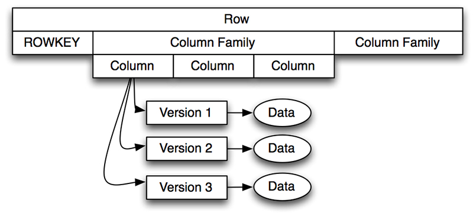

HBase
-----

What is HBase?

- HBase is a Big Data storage system that runs on top of HDFS


HBase vs HDFS
-------------

How does HBase differ from HDFS?

Feature                |HBase                  |HDFS
-------                |-----                  |----
Capacity               |PB+                    |PB+
Data can be modified   |Yes                    |No
Data model             |Key-Value Store        |File System
Search model           |Indexing               |Full-Table Scans
Search time            |Milliseconds           |Seconds to Minutes

HBase History
-------------

Year   |Event
----   |-----
2006   |Google publishes [BigTable paper][big-table]
2006   |Powerset start HBase development 
2008   |HBase becomes Hadoop sub-project
2010   |HBase becomes Apache project
2010   |Facebook chooses HBase for its messaging framework
2011   |HBase 0.90.0 released
2012   |HBase 0.94.0 released
2013   |HBase 0.96.0 released
2014   |HBase 0.99.0 released
2015   |HBase 1.0.0 released

[big-table]: http://research.google.com/archive/bigtable.html


Download HBase
--------------

How can I get HBase up and running on my computer?

### Download HBase

- Download HBase from <http://hbase.apache.org>

- Select: *Mirror* > `stable` > `hbase-1.1.2-bin.tar.gz`

- Expand this using `tar xvzf hbase-1.1.2-bin.tar.gz`

### Edit Config

- `cd` to the expanded directory.

- Edit `conf/hbase-site.xml` so it looks like this (replace
  `/Users/myname` with your home directory).

```xml
<?xml version="1.0"?>
<?xml-stylesheet type="text/xsl" href="configuration.xsl"?>
<configuration>
  <property>
    <name>hbase.rootdir</name>
    <value>file:///Users/myname/hbase</value>
  </property>
  <property>
    <name>hbase.zookeeper.property.dataDir</name>
    <value>/Users/myname/zookeeper</value>
  </property>
</configuration>
```

- By default HBase stores its data in `/tmp` which can easily get
  deleted.

### Setup JAVA HOME

- Edit `conf/hbase-env.sh`, uncomment the line about `JAVA_HOME`.

- On a Mac edit it so it looks like this:

```bash
export JAVA_HOME=$(/usr/libexec/java_home)
```

- On a PC, edit `JAVA_HOME` to point to your Java folder.

### Start HBase in Standalone Mode

```bash
./bin/start-hbase.sh 
```

### Start HBase Shell

```bash
./bin/hbase shell
```

### Stop HBase

After you are done with using HBase you can stop it.

```bash
./bin/stop-hbase.sh
```

HBase Shell
-----------

What is going on?

- `start-hbase.sh` starts HBase in standalone mode.

- The shell is an HBase client that is also a JRuby shell. 

- You can use it to interact with HBase.

- You can also write arbitrary Ruby code in it.

- Try typing `puts "hello world"` in the shell.

HBase Interaction
-----------------

```ruby
# Create table with column family.
create 'test', 'cf'
list 

# Put rows into it.
put 'test', 'row1', 'cf:a', 'value1'
put 'test', 'row1', 'cf:b', 'value2'
put 'test', 'row1', 'cf:c', 'value3'
put 'test', 'row2', 'cf:a', 'value4'
put 'test', 'row2', 'cf:b', 'value5'
put 'test', 'row2', 'cf:c', 'value6'
put 'test', 'row3', 'cf:a', 'value7'
put 'test', 'row3', 'cf:b', 'value8'
put 'test', 'row3', 'cf:c', 'value9'

# Scan contents.
scan 'test'

# Scan by row keys.
scan 'test', {STARTROW=>'row1',STOPROW=>'row3'}

# Scan by row key and limit.
scan 'test', {STARTROW=>'row1',LIMIT=>2}

# Get specific row.
get 'test', 'row1'

# Delete the table.
disable 'test'
drop 'test'
```

Deleting Tables
---------------

What is `disable`?

- Before you drop a table or make other major changes to it you have
  to disable it.

- You can also `enable` a table.

Sales Example
-------------

### Bash

```bash
cat <<'END_OF_DATA' > sales.csv
#ID,Date,Store,State,Product,Amount
101,2014-11-13,100,WA,331,300.00
104,2014-11-18,700,OR,329,450.00
102,2014-11-15,203,CA,321,200.00
106,2014-11-19,202,CA,331,330.00
103,2014-11-17,101,WA,373,750.00
105,2014-11-19,202,CA,321,200.00
END_OF_DATA
```

### Ruby

```ruby
# See if any tables exist.
list

# Create sales table.
create 'sales', 'd'

# Check that it exists.
list

# Put some data into it.
put 'sales', '101', 'd:date','2014-11-13'
put 'sales', '101', 'd:store',100
put 'sales', '101', 'd:state','WA'
put 'sales', '101', 'd:product',331
put 'sales', '101', 'd:amount',300.00

# See what was inserted.
scan 'sales'

# Import CSV.
require 'csv'

# Insert data using loop.
path = 'sales.csv'
CSV.foreach(path) { |id,date,store,state,product,amount| 
  if id.start_with? '#' then 
    next
  end
  key = id
  put 'sales', key, 'd:date',date
  put 'sales', key, 'd:store',store.to_i
  put 'sales', key, 'd:state',state
  put 'sales', key, 'd:product',product.to_i
  put 'sales', key, 'd:amount',amount.to_f
}

# See what was inserted.
scan 'sales'

# Scan range using start stop keys.
scan 'sales', {STARTROW=>'101',STOPROW=>'104'}

# Scan range using length.
scan 'sales', {STARTROW=>'102',LIMIT=>2}

# Get value of a row.
get 'sales', '103'
```

HBase Data Model
================

Tables, Rows, Columns
---------------------

What is HBase's data model?

- HBase's data model is in the form of tables.

- Tables consist of rows and columns.

HBase vs RDBMS
--------------


HBase Data Model
----------------

How is HBase's data model different from a RDBMS?

- Columns in a table are grouped into column families.

- Table schema consists of table name and column family names.

- Column names are not part of the schema.

- Each row stores its own column names.

- You can add new columns any time.

- You cannot add new column families.

HBase Row Example
-----------------





HBase Address Hierarchy
-----------------------


HBase Data Model Details
------------------------

**Table:**

- HBase organizes data into tables. 
- Table names are strings that are legal file names.
- There is no limit on the number of tables.

**Row:**

- Within a table data is stored in rows.
- Rows are identified by row keys. 
- Row keys have no type and are treated as byte arrays.
- There is no limit on the number of rows.

**Column Family:**

- Data within a row is grouped by column family.
- Column families affect physical arrangement of data in HDFS. 
- They are defined up front and cannot be modified.
- Every row in a table has the same column families.
- Column family names are strings that are legal file names.
- HBase recommends at most 3 column families.
- Column family names should short.
- Recommendation: Use 1-character names, e.g. `d`.

**Columns:**

- Data within a column family is stored under columns or column qualifiers.
- Columns are not defined upfront.
- Each row can have different columns.
- Columns have no type and are treated as byte arrays.
- Recommendation: Column names should be short, e.g. `fn`, `ln`.
- There is no limit on the number of columns.

**Cell:**

- A row key, column family, and column qualifier uniquely maps to a cell. 
- Data stored in cell is called the cell's value. 
- Values have no type and are treated as byte arrays.
- Cell sizes should be 10 MB or lower.

**Timestamp:**

- Values in a cell are versioned. 
- Versions numbers are timestamps of when cell was written.
- If timestamp not specified during write current timestamp is used.
- If timestamp not specified for read latest version is returned.
- By default 3 versions are retained. 
- This is configurable for each column family.

Pop Quiz: Excel
---------------

<details><summary>
How would you map an Excel spreadsheet to an HBase table? Assume the
rows in Excel will be rows in HBase, and there are two column
families: `d` for columsn `A` through `Z` and `e` for the other
columns.
called `d`.
</summary>
1. The row keys will be the row numbers: 1, 2, 3, ...<br>
2. The column names will be `d:A`, `d:B`, ..., `d:Z`, `e:AA`, `e:AB`, ... <br>
</details>

Row Key Design
==============

Why Row Key Design
------------------

Why is row key schema design critical for HBase?

- The wrong row key schema can kill the performance of HBase.

- The row key schema has to be closely aligned with the data access
  patterns.

- It is expensive to move data from one schema to another.

How to Design Row Keys
----------------------

What are some heuristics for designing row keys?

- Look at the way you are planning to do `get` on the data.

- Look at the way you are planning to do `scan` on the data.

- Ensure that your scan and get pattern align with the row key.

- Avoid hotspotting.

Hotspotting
-----------

What is hotspotting? It sounds bad.

- Hotspotting is when you `get` different keys on the same
  RegionServer repeatedly.

- For batch processing you want to use `scan` rather than `get`.

- If you are using `get` then you need to ensure that the *hot* rows
  in your table are shared between region servers.


Pop Quiz: Hotspotting
---------------------

<details><summary>
Books & Crooks, a bookseller uses HBase to store customer profiles.
Each customer has an ID and about 100 attributes. They want to look up
customers every time the customer shops. How should they design the
row key?
</summary>
1. The row key could be the customer ID.<br>
2. However, newer customers might cluster together creating a hotspot.<br>
3. You could use reverse of the customer ID as the row key.<br>
4. You can use a hash function.<br>
5. You can salt the row key with a cycling integer.<br>
</details>

Pop Quiz: Average Electricity Usage
-----------------------------------

<details><summary>
PowerGrid uses HBase to store the monthly electricity bills for
customers. Each bill has a customer ID, a date, an address, an amount,
and other information. They want to calculate the average yearly bill
for customers. How should they design their row key?
</summary>
They should use `customerID:year:month` as the key.
</details>

<details><summary>
PowerGrid also wants to calculate the amount of electricity used in
each state and county per month. How should they design their row key?
</summary>
They should use `state:county:year:month:customerID` as the key.<br>
</details>

Pop Quiz: Row Key Conflicts
---------------------------

<details><summary>
What if I have different access patterns and want two conflicting
row key schema? How should I resolve this?
</summary>
1. Use some meaningless but evenly spread out row keys for the database.<br>
2. Create a table for each access pattern.<br>
3. In these *indexing* tables the value is the row key pointing to the
actual data.<br>
</details>

HBase Programming
=================

Gotchas with HBase Shell
------------------------

What are some HBase shell gotchas?

- Make sure you use quotes.

- Make sure you use commas after the first argument.

- Shell displays results of `scan` but does not let you capture them.

Programming HBase
-----------------

How can I extract data from HBase programmatically?

### Option 1: Use Bash

- You have to use the Unix shell to do this.

- And then filter out the result.

```bash
echo 'scan "sales"' | ./bin/hbase shell 
```

- You can also write this using here-docs.

```bash
./bin/hbase shell <<< 'scan "sales" ' 
```

### Option 2: Use hbase-jruby 

#### Bash

```bash
cd $HOME
git clone https://github.com/junegunn/hbase-jruby.git
```

#### HBase Shell

```ruby
# Load library.
hj_path = ENV['HOME'] + '/hbase-jruby/lib'
$LOAD_PATH << hj_path
require 'hbase-jruby'

# Get table.
sales = hbase.table('sales')

# Get specific row.
row = sales.get('101')
row.string('d:state')

# Scan rows.
sales.range('101'..'103').each { |row| 
  puts row.string('d:state') 
  puts row.string('d:amount') 
}
```

Notes:

- See <https://github.com/junegunn/hbase-jruby> for more details on
  the API. 

- Observe that `d:amount` was stored as a string.

- In fact the HBase shell stores all objects as strings.

- This is because HBase does not keep type information.

- If you store something as binary you will need to read it using the
  appropriate `row.type('cf:column')` method.

- You can store objects in other formats using `hbase-jruby`.

### Option 3: Use Java

- HBase is written in Java.

- HBase's Java API is full-featured and provides complete access to HBase.


HBase Architecture
==================

HBase Architecture
------------------


Regions
-------

What are *Regions*?

- Regions are unit of horizontal scalability in HBase. 

- Regions are contiguous sorted range of rows that are stored together.

- Initially, there is one region for a table. 

- When region data exceeds 10 GB it splits on its middle key.

- HBase slaves are called RegionServers. 

- Each RegionServer is responsible to serve a set of regions.

Stores
------

What are *Stores*?

- Each region is made up of *Stores*, one per column family.

- A Store consists of a *MemStore* and 0 or more *StoreFiles*.

- The MemStore contains the most recent writes to the region.

- When the MemStore becomes larger than 64 MB it flushes itself out to
  HDFS into a StoreFile.

Pop Quiz
--------

<details><summary>
How does a get on a row key work in HBase?
</summary>
1. Client contacts appropriate RegionServer.<br>
2. RegionServer looks at the Store for the column family.<br>
3. Store looks at MemStore. If value is there it returns it.<br>
4. If value is not there it scans the StoreFiles until it finds the value.<br>
</details>

Compactions
-----------

What is a *Flush*?

- A flush is when a MemStore writes itself to HDFS to a StoreFile.

What is a *Minor Compaction*?

- A minor compaction is when a RegionServer combines two StoreFiles together. 

What is a *Major Compaction*?

- A major compact is when a RegionServer combines all the StoreFiles
  for a column family together.

What happens in a compaction?

- As store files accumulate the RegionServer compacts them into fewer,
  larger files. 

- Think of the StoreFile as a sequence of operations on the data.

- In a compaction all redundant operations are deleted.

- If I modify a cell 30 times we might just need the last 3 values.

- If a cell is deleted we only need to remember it is deleted.

Pop Quiz
--------

<details><summary>
Can a row be completely deleted in a minor compaction?
</summary>
1. No.<br>
2. There might be older StoreFiles that reference that row.<br>
3. Deletions can only happen in major compactions.<br>
</details>

Pop Quiz
--------

<details><summary>
When a RegionServer is doing a read on a key, what is the order in
which it looks at the MemStore and the StoreFiles?
</summary>
1. It looks at the MemStore first because that is the latest.<br>
2. After this it looks at StoreFiles from newest to oldest.<br>
3. It stops when it finds the value it is looking for.<br>
</details>


MemStore Failure and WAL
------------------------

What if the machine holding a MemStore in memory fails? How does HBase
recover from this?


- HBase recovers from this through a *Write Ahead Log* or *WAL*.

- The WAL records all changes to HBase data into HDFS.

- If a RegionServer crashes before the MemStore is flushed, its
  replacement RegionServer reads the WAL to catch up.

- Usually there is one WAL per RegionServer. 

- The RegionServer records Puts and Deletes to the WAL before
  recording them to the MemStore for the affected Store.

- If the WAL write fails the operation to modify the data fails.

