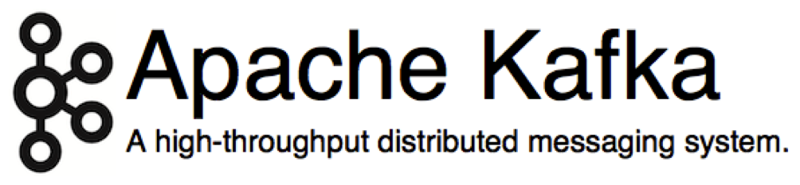
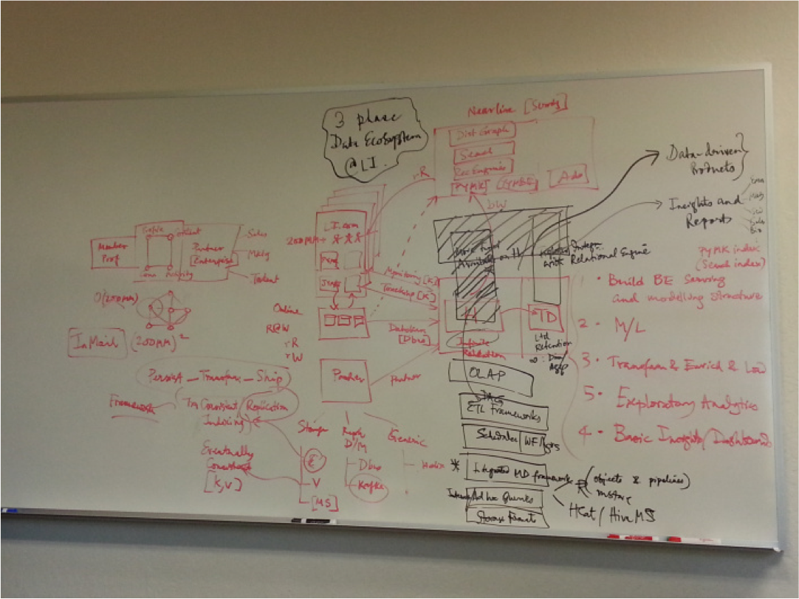
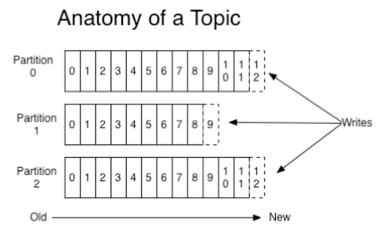
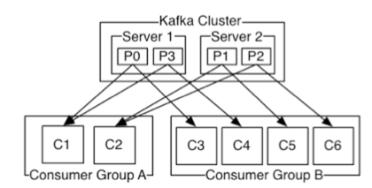

Apache Kafka
============

Kafka
-----



What is Kafka?

- Kafka is like TiVo for real time messages.

- Producers write events.

- Consumers process events when they can.

What are events?

- Events are messages or objects.

- Think data structures containing fields.

- Like SQL records or CSV records.

Etymology
---------

Why is it called Kafka?

According to [Jay Kreps](https://news.ycombinator.com/item?id=6878186)

- The rationale was that it should be a writer because we were
  building a distributed log or journal (a service dedicated to
  writing). 

- The writer needed to be someone that (1) I liked, (2) sounded cool
  as a name, (3) was dead (because it would be creepy to use the name
  of someone who was alive).

Jay Kreps
---------


Who is Jay Kreps?

- Co-founder of <http://confluent.io>. 

- Architect and co-creator of Apache Kafka.

- Author of [*I Heart Logs*](http://shop.oreilly.com/product/0636920034339.do)

Franz Kafka
-----------


History of Kafka
----------------

Year |Event
---- |-----
2011 |Open sourced at LinkedIn
2012 |Version 0.7.1 released
2012 |Graduated from Apache incubator status
2013 |Version 0.8.0 released
2014 |Confluent spins off from LinkedIn with goal to productize Kafka
2014 |Version 0.8.1 released
2015 |Version 0.8.2.0 released

Programming Languages
---------------------

What language is Kafka written in?

- Kafka is mostly written in Scala.

- Its API supports Scala, Java, and Python.

Why Does Kafka Exist
--------------------

LinkedIn’s motivation for Kafka was *A unified platform for handling all the
 data feeds a large company might have.* Some of the 'must haves' kept
in mind by LinkedIn engineers were:

- High throughput to support high volume event feeds.
- Support  processing of these feeds to create new, derived feeds.
- Support large data backlogs to handle periodic ingestion from offline systems.
- Support low-latency delivery to handle more traditional messaging use cases.
- Guarantee fault-tolerance in the presence of machine failures.

Kafka Architecture
------------------

Image of a 2013 discussion of Kafka's Data Architecture at LinkedIn:



Use Cases
---------

- **LinkedIn** 
    - Processes more than 200 billion events/day via Kafka. 
    - Primary types of data being processed through Kafka are:
        - Metrics: operational telemetry data
        - Tracking: everything a LinkedIn.com user does
        - Queuing: between LinkedIn apps, e.g. for sending emails
- **Netflix** 
    - Real time monitoring and event processing.
- **Twitter** 
    - As part of their Storm and Heron  data pipelines.
- **Spotify**
    - Log delivery (from 4h down to 10s), Hadoop.
- **Loggly** 
    - Log collection and processing.
- **Mozilla** 
    - Telemetry data.
    - Data that Firefox receives from browsers in the wild.

Why Is Kafka Fast
-----------------

- Fast writes:
    - While Kafka persists all data to disk, essentially all writes go
      to the page cache of OS, i.e. RAM.
    - Configuration hardware specs and OS tuning.
- Fast reads:
    - Very efficient to transfer data from page cache to a network
      socket
    - Kafka uses the `sendfile()` system call to transfer data
      directly from disk to network, without copying it into multiple
      buffers.
- Combination of the two = fast Kafka!
    - For example, on a Kafka cluster where the consumers are mostly
      caught up you will see no read activity on the disks as they
      will be serving data entirely from cache.

Kafka and Big Data Systems
--------------------------

Why is Kafka used in Big Data systems?

- Traditionally Big Data systems were batch-oriented.

- There are many benefits to doing analytics in real time. 

- You can detect fraud, network intrusion, etc. and respond to events immediately.

- Storm and Spark Streaming let you process data in real time.

Why do we need Kafka with Storm and Spark Streaming?

- What happens when your data comes in faster than you can process it?

- Kafka buffers data so your processes don't crash.

- If systems crash or go offline for maintenance Kafka will let them replay the data.

- Kafka stores data for a week by default.

Kafka Analogies
---------------

- Kafka is like a *Universal Power Supply* for data.

- Kafka is like TiVo.

- Kafka is like Twitter.

Kafka, Spark, HBase
-------------------


Kafka, Spark, HBase
-------------------

How does Kafka relate to HBase and Spark?

- Kafka, Spark Streaming, and HBase are frequently used together.

- Kafka is the real time data pipeline.

- Spark Streaming is the real time data processing engine.

- HBase is the real time data storage.

- Data comes in through Kafka, is processed by Spark Streaming, and is
  then saved to HBase.


Kafka Architecture
==================

Producers, Consumers, Brokers
-----------------------------


Producers, Consumers, Brokers
-----------------------------

What are *producers*, *consumer*, *brokers*?

- Kafka producers write messages to brokers.

- Kafka brokers buffer and retain messages. By default they retain
  messages for a week.

- Kafka consumers read messages.

- Producers and consumers are external to Kafka.

- Brokers are what constitute Kafka.

Producers, Consumers, Brokers
-----------------------------

Intuitively, what are *producers*, *consumer*, *brokers*?

- Think of producers as people posting tweets.

- Think of consumers as people reading tweets.

- Think of brokers as Twitter itself.

Topics
------


Topics
------

What are *topics*?

- Topics define message streams.

- Producers write to specific topics.

- Consumers read from specific topics.

- Think of these as your favorite show on TV or as Twitter hashtags.

Partitions
----------


Partitions
----------

What are *partitions*?

- A topic is made up of partitions.

- Producer write messages into partitions.

- Each message goes into a particular partition.

- Each partition is on a specific broker.

Pop Quiz: Partitions
--------------------

<details><summary>
Can a partition have more data than the disk space on a single broker
machine?
</summary>
1. No. <br>
2. A partition must fit on a single machine.<br>
</details>

<details><summary>
Can a topic have more data than the disk space on a single broker
machine?
</summary>
1. Yes. <br>
2. A topic can have multiple partitions.<br>
3. With partitions Kafka a topic hold more messages than can fit on a machine.<br>
</details>

Partitions and Messages
-----------------------



Partitions and Messages
-----------------------

How does the producer determine which partition a message belongs to?

- Default partitioning: round-robin.

- Key partitioning: each message has a key and is partitioned by its
  key.

- Custom partitioner: a custom partitioner class has an opportunity to
  look at the key and message and determine which partition to send
  the message to.

Pop Quiz: Partitioners
----------------------

<details><summary>
If my topic has 5 partitions, will I have 5 copies of every message?
</summary>
1. No.<br>
2. Each message is written in a particular partition.<br>
</details>


Partitions
----------

Why do partitions exist?

- Partitions make the data more parallel.

- Different consumers can consume partitions in parallel.

Partitions, Consumers, Consumer Groups
--------------------------------------



Partitions, Consumers, Consumer Groups
--------------------------------------

How do collections of consumers coordinate their consuming? And what
are *consumer groups*?

- Consumer groups are collections of consumers that consume a topic
  together.

- The partitions are divided between the consumers in a *consumer
  group*.

- Each consumer group will see all the messages in the topic.

- Each consumer in a consumer group will see all the messages in the
  partitions assigned to it.

- Each partition has exactly one consumer in each consumer group.


Pop Quiz: Consumer Groups
-------------------------

<details><summary>
Suppose you order two pizza for 4 people. One is meat the other is
vegetarian. What Kafka concepts do slices, pizzas, and people
correspond to?
</summary>
1. The slices are messages.<br>
2. The pizzas are partitions.<br>
3. The two vegetarians are consumers who are assigned the vegetarian
partition.<br>
4. The two non-vegetarians are consumers who are assigned the meat
partition.<br>
</details>

Pop Quiz: Consumer Groups
-------------------------

<details><summary>
If two consumer groups are consuming from the same topic, will each
one of them get all the messages in the topic?
</summary>
1. Yes.<br>
2. Every consumer group sees all the messages.<br>
</details>

<details><summary>
If a consumer group has 2 consumers and the topic has 8 partitions,
how many partitions will each consumer get?
</summary>
Each consumer will get 4 of the partitions.
</details>

<details><summary>
If a consumer group has 8 consumers and the topic has 2 partitions,
how many partitions will each consumer get?
</summary>
1. Two of the 8 consumers will get a partition each.<br>
2. The other 6 consumers will not get any partitions.<br>
</details>

<details><summary>
If a consumer group has 2 consumers and the topic has 2 partitions,
will each consumer see all the messages? 
</summary>
1. No.<br>
2. Each consumer will only see the topics in its partition.<br>
</details>

Partition Offset
----------------

How does a consumer keep track of where it is in the partition?

- Messages in partitions are assigned a sequential id number called
  the _offset_ that uniquely identifies each message within the
  partition.

- Consumers track their position in partitions through tuples made up
  of `(topic, partition, offset)`.


Replicas
--------


Replicas
--------

What happens if a broker fails? Do we lose all the messages on the
partitions on that broker? 

- To prevent losing the partitions, partitions are replicated across
  brokers.

- The identical copies of a partition are called *replicas*.

Leaders and Followers
---------------------

How does Kafka determine which replica to read from and write to?

- The replicas are pure backup.

- They are never read from or written to.

- The brokers holding the partitions for a topic elect a leader.

- The leader receives all the read and write requests.

- The followers are plain consumers and try to keep up.

Elections
---------

What happens if a leader dies?

- The followers who are in sync with the leader nominate themselves
  for the office of the leader.

- If no one is in sync then the follower with the most messages
  becomes the leader.

Pop Quiz: Replication
---------------------

<details><summary>
If a topic has 8 partitions, and each partition is replicated 3 times,
how many copies of each message in this topic exist in Kafka?
</summary>
3 copies.
</details>


Kafka Commands
==============

Creating Topics
---------------

How can I create a topic?

You can create topics using the command line `kafka-topics.sh` tool.

```bash
./bin/kafka-topics.sh \
  --zookeeper localhost:2181 \
  --create \
  --topic my-topic \
  --replication-factor 1 \
  --partitions 1
```

The default values of `--replication-factor` and `--partitions`  is
`1` so they can be left out.
  
```bash
./bin/kafka-topics.sh \
  --zookeeper localhost:2181 \
  --create \
  --topic my-topic
```

Changing Topic Configuration
----------------------------

How can I change the configuration value per topic?

You can change the maximum message size from `1000*1000` to `64000`.

```bash
./bin/kafka-topics.sh \
  --zookeeper localhost:2181 \
  --topic my-topic \
  --alter \
  --config max.message.bytes=64000
```

Describing Topic
----------------

How can I find the configuration settings of a topic?

```bash
./bin/kafka-topics.sh \
  --zookeeper localhost:2181 \
  --topic my-topic \
  --describe
```

Reverting Configuration Overrides
---------------------------------

How can I revert a configuration override?

```bash
./bin/kafka-topics.sh \
  --zookeeper localhost:2181 \
  --topic my-topic \
  --alter \
  --deleteConfig max.message.bytes
```

Deleting Topics
---------------

How can I delete a topic?

```bash
./bin/kafka-topics.sh \
  --zookeeper localhost:2181 \
  --topic my-topic \
  --delete 
```

Kafka API
=========

Sending Receiving Strings
-------------------------

How can I use Kafka to send and receive strings?

```python
import threading, logging, time

from kafka.client   import KafkaClient
from kafka.consumer import SimpleConsumer
from kafka.producer import SimpleProducer

class Producer(threading.Thread):
    '''Sends messages to Kafka topic.'''
    daemon = True
    def run(self):
        client = KafkaClient("localhost:9092")
        producer = SimpleProducer(client)
        while True:
            producer.send_messages('my-topic', "test")
            producer.send_messages('my-topic', "Hello, world!")
            time.sleep(1)


class Consumer(threading.Thread):
    '''Consumes messages from Kafka topic.'''
    daemon = True
    def run(self):
        client = KafkaClient("localhost:9092")
        consumer = SimpleConsumer(client, "test-group", "my-topic")
        for message in consumer:
            print(message)

def main():
    '''Starts producer and consumer threads.'''
    threads = [ Producer(), Consumer() ]
    for t in threads:
        t.start()
    time.sleep(5)

if __name__ == "__main__":
    logging.basicConfig(
        format='%(asctime)s.%(name)s:%(message)s',
        level=logging.DEBUG)
    main()
```

Kafka, Avro
-----------


Kafka, Avro
-----------

Why is Avro relevant to Kafka?

- Kafka messages are byte sequences.

- Kafka only knows how to handle byte sequences.

- To send rich data structures through Kafka you have to serialize
  them.

- Avro gives you efficient and portable serialization.

Sending Receiving Using Avro
----------------------------

How can I use Kafka to send and receive arbitrary data structures?

```python
import io, random, threading, logging, time

import avro.io
import avro.schema

from kafka.client   import KafkaClient
from kafka.consumer import KafkaConsumer
from kafka.producer import SimpleProducer

KAFKA_TOPIC = 'my-topic'

AVRO_SCHEMA_STRING = '''{
	"namespace": "example.avro",
	"type": "record",
	"name": "User",
	"fields": [
		{"name": "name", "type": "string"},
		{"name": "favorite_number",  "type": ["int", "null"]},
		{"name": "favorite_color", "type": ["string", "null"]}
	]
}
'''

class AvroSerDe:
    '''Utility class for serializing and deserializing data structures
    using Avro.
    '''
    def __init__(self, avro_schema_string):
        self.schema = avro.schema.parse(avro_schema_string)
        self.datum_writer = avro.io.DatumWriter(self.schema)
        self.datum_reader = avro.io.DatumReader(self.schema)

    def obj_to_bytes(self, obj):
        bytes_writer = io.BytesIO()
        encoder = avro.io.BinaryEncoder(bytes_writer)
        self.datum_writer.write(obj, encoder)
        raw_bytes = bytes_writer.getvalue()
        return raw_bytes

    def bytes_to_obj(self, raw_bytes):
        bytes_reader = io.BytesIO(raw_bytes)
        decoder = avro.io.BinaryDecoder(bytes_reader)
        obj = self.datum_reader.read(decoder)
        return obj

def random_user():
    '''Generate random user.'''
    user = {'name': random.choice(['Alice','Bob','Cher','Diane','Elvis']),
            'favorite_color': random.choice(['red','green','blue']),
            'favorite_number': random.randint(0,10)}
    return user

class Producer(threading.Thread):
    '''Produces users and publishes them to Kafka topic.'''
    daemon = True
    def run(self):
        avro_serde = AvroSerDe(AVRO_SCHEMA_STRING)
        client = KafkaClient('localhost:9092')
        producer = SimpleProducer(client)
        while True:
            raw_bytes = avro_serde.obj_to_bytes(random_user())
            producer.send_messages(KAFKA_TOPIC, raw_bytes)
            time.sleep(1)

class Consumer(threading.Thread):
    '''Consumes users from Kafka topic.'''
    daemon = True
    def run(self):
        avro_serde = AvroSerDe(AVRO_SCHEMA_STRING)
        client = KafkaClient('localhost:9092')
        consumer = KafkaConsumer(KAFKA_TOPIC,
                                 group_id='my_group',
                                 bootstrap_servers=['localhost:9092'])
        for message in consumer:
            user = avro_serde.bytes_to_obj(message.value)
            print '--> ' + str(user)

def main():
    '''Starts producer and consumer threads.'''
    threads = [ Producer(), Consumer() ]
    for t in threads: t.start()
    time.sleep(5)

if __name__ == '__main__':
    logging.basicConfig(
        format='%(asctime)s.%(name)s:%(message)s',
        level=logging.DEBUG)
    main()
```
